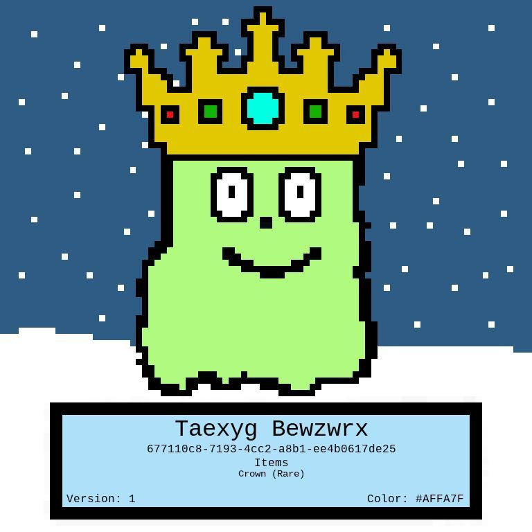

# Slime	Generator

A CLI tool that allows you to create slime with fun attributes! It supports a local SQLite database which stores information about each slime. 

Creates a Slime:
   
1) Creates Attributes of the Slime (UID, Version, Name, Color, Template, and Accessories), in a Slime object
2) Creates Slime Picture, containing Attributes
3) Inserts data(Slime attributes/picture) into Database
4) Optional actions such as read actions / stats and graphs

According to the RNG, accessories will be chosen for the slime (up to two). There are common, uncommon, and rare accessories. 

| Rarity    | Item |
| -------- | ------- |
| Common   | sunglasses, sunhat    |
| Uncommon | top hat, wizard hat, mustache     |
| Rare     | robin hood hat, santa hat, crown, golden top hat, golden sunglasses    |




## Table of Contents

- [Installation](#installation)
- [Usage](#usage)
- [Examples](#examples)
- [Design](#design)

## Installation

```pip install -r requirements.txt```


## Usage
```
usage: slimegenerator.py [-h] -n NUMBER [-g] [-v] [-r] [-i]

Slime CLI tool

optional arguments:
  -h, --help            show this help message and exit
  -n NUMBER, --number NUMBER
                        Define how many slime you would like to create
  -g, --graph           Pass this if you would like to view a graph
  -v, --verbose         Print slime information and creation times
  -r, --rare            Rare Detector: prints information when a rare occurance happens
  -i, --images          Prints the slime image in the img/ directory
  ```

## Examples

1) Create 10 slime, displaying a graph to show their creation times.

    `python3 slimegenerator.py -n 10 -g`

2) Create 15 slime, being verbose to see them get created

    `python3 slimegenerator.py -n 15 -v`

3) Create 20 slime, printing when there's a rare item,  while showing a graph

    `python3 slimegenerator.py -n 20 -r -g`

4) Create 100 slimes and Enable all!

    `python3 slimegenerator.py -n 100 -g -v -r -i`

## Design

After image creation, this information gets put into the local SQLite database. 

    +-------------------+      		  
    |       Slime       |       
    +-------------------+    		 
    | Slime ID (PK)     |               
    | Version           |             
    | Name              |               
    | Color             |        	  
    | Template          |        
    | SlimeImage        |       
    +-------------------+        
                                 
             ^                   
             |
    +-------------------+  
    |    Accessories    |
    +-------------------+  
    | SlimeID (FK)      | 
    | AccessoryName     |
    +-------------------+ 

